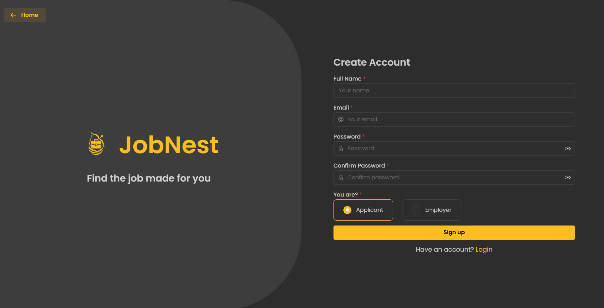
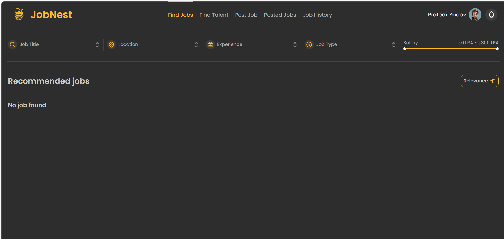
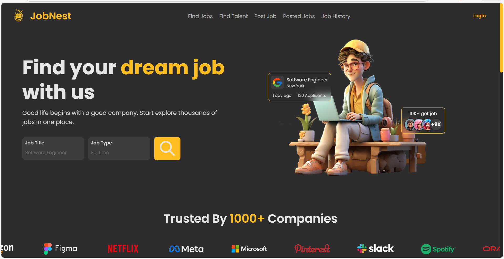

# 💼 Job Portal Application (MERN-Style with Java Backend)

# 💼 Job Portal Application (MERN-Style with Java Backend)

A full-stack **Job Portal Web Application** built using **React + TypeScript** for frontend and **Java + Spring Boot + MongoDB** for backend.  
The system allows **Job Seekers**, **Employers**, and **Admins** to manage job postings, applications, profiles, and notifications with secure JWT-based authentication.

This project demonstrates real-world **Java Full Stack Development** with modern architecture and clean code practices.

---

## 🚀 Features

### 👤 Job Seeker
- Register & Login  
- Create & Update Profile  
- Search & View Jobs  
- Apply for Jobs  
- View Application Status  
- Receive Notifications  

### 🏢 Employer
- Register & Login  
- Post New Jobs  
- Update & Delete Jobs  
- View Applicants  
- Manage Job Status  

### 🛡 Admin
- Manage Users  
- Manage Jobs  
- Monitor Platform Activity  

### 🔐 Security
- JWT Authentication  
- Role-Based Authorization  
- Encrypted Passwords  

---

## 🧰 Tech Stack

### Frontend
- React  
- TypeScript  
- HTML5  
- CSS3  
- Axios  

### Backend
- Java  
- Spring Boot  
- Spring Security  
- JWT  
- Maven  

### Database
- MongoDB  

---

## 🏗 Project Architecture

```
JOBPORTAL
│
├── backend
│   └── src/main/java/com/jobportal
│       ├── api
│       ├── dto
│       ├── entity
│       ├── repository
│       ├── service
│       ├── jwt
│       ├── utility
│       └── JobPortalApplication.java
│
├── frontend
│   └── src
│       ├── components
│       ├── pages
│       ├── services
│       └── App.tsx
│
└── README.md
```

---

## ⚙️ Installation & Setup

### 🔹 Prerequisites
- Java 17+  
- Node.js 18+  
- MongoDB  
- Maven  

---

### 📥 Clone Repository

```bash
git clone https://github.com/your-username/job-portal.git
cd job-portal
```

---

### ⚙️ Backend Setup

```bash
cd backend
mvn clean install
mvn spring-boot:run
```

---

### 🗄 MongoDB Configuration

Add in `application.properties`

```properties
spring.data.mongodb.uri=mongodb://localhost:27017/jobportaldb
spring.data.mongodb.database=jobportaldb
server.port=8080
```

---

### 🎨 Frontend Setup

```bash
cd frontend
npm install
npm run dev
```

---

### 🌐 Access Application

- Frontend: http://localhost:5173  
- Backend:  http://localhost:8080  

---

## 🔁 API Modules

- AuthAPI  
- UserAPI  
- JobAPI  
- ProfileAPI  
- NotificationAPI  

---

## 🧪 Testing

- Backend APIs tested using Postman  
- Frontend tested manually  

---

## 📈 Future Enhancements

- Resume Upload & Parsing  
- Email Notifications  
- Chat System  
- Admin Dashboard Analytics  
- Docker Deployment  
- Cloud Hosting (AWS)  

---

## 📸 Screenshots

### Login Page


### Register Page


### Jobs Page


### Dashboard


---

## 👨‍💻 Author

**Prateek Yadav**  
Java Full Stack Developer  

---

## 📜 License

This project is licensed under the **MIT License**.
